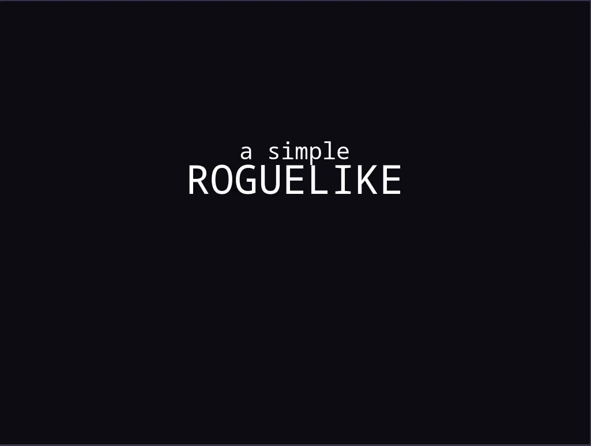

#  Roguelike

---

<p align="center">
   
</p>

<p align="center">
<a href='https://giuxtaposition.github.io/roguelike/'>Go check it out 🎉</a>
</p>

---

# 📌 Table of Contents

- [ Roguelike](#-roguelike)
- [📌 Table of Contents](#-table-of-contents)
  - [👩‍💻 Project Description](#-project-description)
  - [🎉 Features](#-features)
  - [👷 Running Locally](#-running-locally)
  - [🔧 Built with](#-built-with)
  - [🧪 Testing with](#-testing-with)

## 👩‍💻 Project Description

A small roguelike game made in `Svelte`.
In this project I tried to better my understanding of the `<canvas>` element and what it could do.
I also challenged myself to learn some pixel art basics and made all the sprites on my own.

## 🎉 Features

- Move player with `wasd` keys and attack enemies.
- Use spells with number keys.
- A variety of enemies to battle with.
- Keep highscores.
- Animations and sounds for better gameplay.

## 👷 Running Locally

``` bash
git clone https://github.com/giuxtaposition/roguelike.git
cd roguelike
yarn install
yarn dev
```

## 🔧 Built with

- [Svelte](https://svelte.dev/)
- [Typescript](https://www.typescriptlang.org/)
- [Vite](https://vitejs.dev/)
- [Aseprite](https://www.aseprite.org/) for the art.

## 🧪 Testing with

- Vitest
